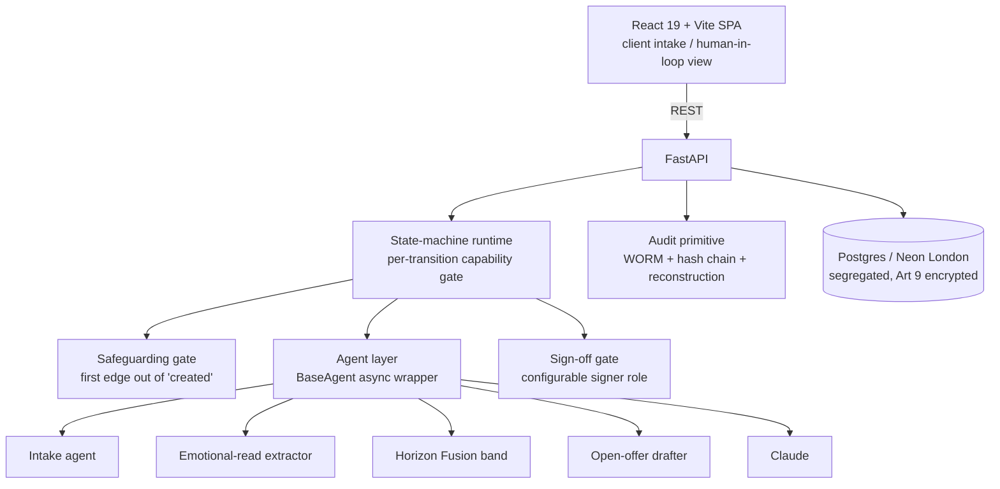

# Engineering build plan

*The build whitepaper. Synthesised 2026-05-27 from four parallel planning passes over the reusable code across related open projects (Legalise, counsel-mvp, Courtless, agent-kit).*

---

## 0. The build decision

**Base: fork Legalise.** It already contains Kramer's four hardest, most differentiated primitives, almost one-to-one:

| Kramer needs | Legalise already has | File |
|---|---|---|
| the supervision dial | state-machine, per-transition `required_capability` | `backend/app/core/state_machine/runtime.py` |
| configurable gate signer | advice-boundary role tiers | `backend/app/core/advice_boundary/tiers.py` |
| safeguarding-first gate | the posture-gate pattern | `backend/app/core/posture_gate.py` |
| Art 22 audit chain | audit middleware + WORM trigger + reconstruction | `backend/app/core/audit.py`, `audit_reconstruction.py`, `alembic/versions/0011_audit_worm.py` |

**Agent layer: port `BaseAgent` + drafting from counsel-mvp** (`backend/app/agents/base.py`, `routers/drafting.py`).
**Stack:** FastAPI + React 19/Vite + Postgres, Cloudflare Pages + Fly.io (lhr) + Neon (London) — the proven Legalise deploy template. **Not Next.js** (the agents are Python; rewriting them in TS wastes the day).
**Text-only for the hackathon.** Voice (Decipher's LiveKit pipeline) is a v0.1+ option, never the Saturday risk.

**Fallback** if stripping Legalise isn't clean by Saturday midday: thin counsel-mvp fork (already has `BaseAgent` + `audit_log` + drafting) with the dial/gate faked. Decide Friday night.

---

## 1. Architecture

A matter is a single instance moving through state-machine transitions; each transition carries a `required_capability` (the dial) and may be gated.



**End-to-end flow (one matter):** create (posture paused) → **safeguarding screen runs first**; a signal forces a hold + escalation, no number ever produced → **Frame Capture**: two segregated intake sessions, each emitting an emotional read (sealed, HITL-only) + Form-E-lite → **Horizon Fusion**: reason over both frames + financials → settlement band (overlap zone, scenarios, durability notes) → **Durable Settlement**: draft open offer, run disclosure-confirmation + pressure-check, stop at configurable sign-off gate(s) → consent-order handoff. Every transition writes an audit row (who / when / evidence-hash / override notes).

## 2. The supervision dial in software

The dial *is* the state-machine's per-transition `required_capability` bound to advice-boundary role tokens. Flipping it is editing one config value per matter, not changing the engine:

- **two solicitors:** gate transitions require `qualified_solicitor`, one capability grant per party (data segregated).
- **one solicitor / neutral mediator:** single `qualified_solicitor` grant scoped to the neutral.
- **no lawyer / advice-only:** `required_capability` lowered to `any_authenticated`; audit row still records a meaningful human action (Art 22 satisfied); advice tier capped.

Hard-wired, *not* dialable: (a) safeguarding is the mandatory first edge out of `created`; (b) the audit row writes on every transition outcome; (c) the emotional read is role-scoped to the HITL human and never on a client-facing read path; (d) bands persist as a list of scenarios with durability notes — no single recommended value, no nudge field.

## 3. Data model & compliance spine

Fork Legalise's `audit_entries` + WORM trigger + reconstruction verbatim; add Kramer tables:

```
matters (id, slug, status, safeguarding_state[unscreened|cleared|flagged], retention_until, created_by)
  ├─< parties (id, matter_id, side[A|B], display_name, solicitor_user_id?, dek_key_ref)
  │     ├─< emotional_reads (id, party_id, ciphertext BYTEA, dek_wrapped, nonce,
  │     │     visibility='hitl_only', created_by[ai|human], llm_invocation_id)
  │     └─< financial_disclosure (id, party_id, form_e_json[encrypted],
  │           disclosure_confirmed_at, disclosure_confirmed_by)
  ├─< settlement_bands (id, matter_id, scenarios JSONB, overlap_low/high, durability,
  │     inputs_hash → binds band to the exact reads+disclosure it reasoned over, llm_invocation_id)
  ├─< gates (id, matter_id, gate_type[safeguarding|disclosure|pressure_check|signoff],
  │     required_signer_role, status, signer_user_id, decided_at, override_notes, evidence_ref → audit_entry.id)
  └─< audit_entries (Legalise model + matter/party/gate refs, prev_hash, entry_hash)
```

**Segregation (A unreachable by B's side) — three layers, all required:**
1. **Postgres Row-Level Security** keyed to a session GUC (`SET app.current_party`) — not app WHERE-clauses (they leak under bugs).
2. **Per-party encryption keys (DEK):** A's reads + disclosure encrypted under A's DEK, wrapped by a KMS master key. Even with raw DB access, B's side holds no key to A's ciphertext. Segregation is cryptographic, not just relational.
3. **Single `scoped_session(party)` accessor** as the only path to party data; a test asserts no raw `select(EmotionalRead)` exists outside it.

**Audit artefact (Art 22):** append-only (WORM trigger) + **hash chaining** (`entry_hash = SHA256(prev_hash ‖ canonical(row))` per matter; nightly seal the head hash externally). Each gate emits one artefact: who (signer + role), when, on-what-evidence (band `inputs_hash`, disclosure refs), override_notes. Reconstruct via Legalise's `audit_reconstruction.reconstruct()`.

**Encryption-at-rest:** envelope encryption, per-party DEK wrapped by cloud KMS; ciphertext as `BYTEA`, never plaintext columns (TDE alone can't give per-party segregation). **Retention/erasure: crypto-shredding** — destroy a party's DEK and their Art 9 data is irrecoverable, while the hash-chained audit (hashes/metadata only, no special-category plaintext) survives. Reconciles right-to-erasure with WORM audit.

## 4. Agent pipeline

All five subclass `BaseAgent` (async Claude call, SHA-256 in/out hashing, audit row per call — the Art 22 spine for free). Run order is gated: **2 → 1 → 3 → 4 → 5**.

1. **Intake** (Sonnet) — empathic mirror; Gottman/EFT as a *listening lens*; no advice, no numbers, no judging the absent party (preserve the *Thou*). Plain-text out. Failure: drifting into advice / both-sidesing / leading questions.
2. **Safeguarding classifier** (Sonnet; optional Haiku pre-filter) — FIRST gate; signal taxonomy (financial control, fear, monitoring, minimisation) + a **mirror-language cross-check** (identical phrasing across the two segregated intakes is a coercion tell). JSON: `{risk, signals[], confidence, rationale, recommend_human_triage}`. **Honest limit:** a transcript *cannot* reliably detect coercion — recall over precision, any signal → human triage; the classifier is a triage assist, not a detector. Failure: false negatives (catastrophic).
3. **Emotional-read extractor** (Sonnet) — post-conversation, one call/party → JSON hypotheses (not diagnoses), HITL-only, never client-facing. Every field hedged + a verbatim evidence quote. Mirrors Courtless `IndividualAuditor` shape. Failure: diagnostic over-reach; leaking to client UI.
4. **Horizon Fusion band** (Opus — hardest reasoning) — overlap zone, s.25 MCA-aware, durability-scored, scenarios not advice; emotional driver shifts the overlap (over-valued asset). JSON: `{scenarios[≥2]{label, split, rationale, durability_score, why_it_holds, why_it_might_decohere}, overlap_band{low,high}, s25_factors[]}`. Failure: collapsing to a point; one-siding; confident-theatre durability.
5. **Open-offer drafter** (Sonnet/Haiku) — lift `LetterDraftAgent`; add one `TEMPLATES["open_offer"]` (FPR 28.3 structure); **delete the Part 36 / without-prejudice templates** (wrong instrument). Plain text. Failure: mislabelling as Calderbank/WP (inverts costs); numbers not in the signed-off band.

**Voice vs text:** Decipher reuse = ~60% generic but ~4–5 hrs infra/credentials + three framework patches on the day, vs ~1.5–2 hrs for text. **Hackathon: text only. v0.1: voice on intake only** (where tone matters), band/offer stay text.

**Evals (agent-kit):** add one `/api/internal/eval/<agent>` endpoint per agent (matches the stub contract). Wire **safeguarding + band first** (the safety + legal load). Measure: **safeguarding recall** (labelled coercion-positive incl. coached/subtle + clean; track false-negative rate; mirror-language pairs), **band-shape regression** (`length_bounds scenarios min:2`, `not_null overlap_band`, guard point-collapse + one-siding), emotional-read (`schema_valid`, evidence-quote present, no diagnostic-label leakage), offer (`regex` asserts "open offer" present, "Calderbank"/"without prejudice" absent). The dataset is the asset — every prod surprise becomes a regression record.

## 5. Hosting, infra, security

**Phase 0 (Saturday, synthetic data):** run **localhost** — counsel-mvp/Legalise use SQLite/local Postgres, so no hosting needed to demo. Only must-have is an **Anthropic key**. Optional live URL: Fly (API) + Cloudflare Pages (frontend), the Legalise template.

**Phase 1 (v0.1, real Art 9 data):** Cloudflare Pages (frontend) + **Fly.io lhr** (backend/LLM orchestration, UK processing) + **Neon Postgres London / eu-west-2, pinned** (region can't move in place — plan a migration) + Anthropic (server-side only) + auth (Clerk/Auth.js, two-solicitor/two-party scoping) + Resend (offer letters) + Fly secrets.

**Security posture (before any non-synthetic user):** UK residency (Neon eu-west-2, Fly lhr); encryption at rest + per-party DEK; per-matter/per-party access control (no merged store); the audit chain on every gate; standalone explicit consent + documented lawful basis (Art 9(2)(f) in a regulated firm, else explicit consent); **DPIA** written. **Model-data question (load-bearing):** matter content goes to Anthropic on every call — enable **zero-data-retention / no-training** terms on the account before real data flows; until confirmed, synthetic data only. Document Anthropic as a sub-processor in the DPIA.

**Cost:** Phase 0 ≈ £0–5. Phase 1 ≈ £40–90/mo (Fly £5–15, Neon £15–20, Anthropic £10–40, Resend/Upstash free–£15, domain ~£1).

## 6. Phased build steps (ordered, with dependencies)

**Phase 0 — Saturday MVP (text-only, single matter):**
1. Fork Legalise; strip to one matter + state-machine + audit + auth. *(dep: —)*
2. Define the matter machine: `created → safeguarding → frame_capture → horizon_fusion → drafting → gate → done`. *(1)*
3. Port `BaseAgent` from counsel-mvp into the agent layer. *(1)*
4. Safeguarding agent + gate as the first transition (posture-gate; signal → hold + escalation screen). *(2,3)*
5. Frame Capture: text intake → emotional read (sealed) + Form-E-lite. *(3,4)*
6. Horizon Fusion band prompt over both frames + financials. *(5)*
7. Open-offer draft (lift drafting + one new template entry). *(6)*
8. One sign-off gate transition + audit row on screen; pressure-check before send. *(7)*
9. HITL view: emotional read + band + draft + gate card. *(5–8)*

**Phase 1 — v0.1 (June):** persistent multi-matter; three named gates; explicit-consent + DPIA flow; per-party DEK + RLS + WORM role-split REVOKE; hash-chain verifier + tamper alarm; dial config surfaced in matter setup; audit-reconstruction export; safeguarding/band wired to agent-kit evals; Anthropic ZDR confirmed.

**Phase 2+:** voice intake (Decipher pipeline behind the same intake agent); SRA-authorised-entity / ABS deployment of the dial; PI-underwriter audit export; consent-order generation.

## 7. Prep first — accounts & services

**For Saturday (do tonight/Friday, in order):**
1. **Anthropic API key + billing** — the only true must-have. Add payment now; new keys can hit low rate limits, so generate and test a real call early.
2. **Confirm the Legalise fork runs locally** (SQLite/local Postgres) — strip Friday night; this *is* the go/no-go for the Legalise-vs-fallback decision.
3. *(optional, only if you want a live URL)* Fly.io + Cloudflare Pages, per the Legalise template.

**For v0.1 (after the hackathon, before real users):**
4. **Domain** — buy early (DNS + email-domain verification take hours). Pick a real-product name (Solomon / The Yardstick).
5. **Neon paid, eu-west-2 (London), pinned** — recreate in-region (can't move in place).
6. **Fly.io lhr app** — backend/LLM orchestration in London.
7. **Anthropic ZDR / no-training terms** — contact Anthropic; possible lead time / commit. Blocks real data until confirmed.
8. **Auth** (Clerk / Auth.js) — two-solicitor / two-party scoping.
9. **Resend** — verify sending domain (DNS lead-time) for offer letters.
10. **DPIA + consent flow + PI insurance** — non-infra but gating for real users.

---

## 7b. Sync points from Legalise master (2026-05-30)

The fork base picks up four helpers + one copy rule that landed during the KISS / elegance pass on Legalise (currently on branch `repo-cleanup-pass`, not yet merged to master — rebase from that ref until merged).

- **`extracted_body_for(session, document_id)`** — `backend/app/models/document_body.py`. The only correct way to load a document body for source-anchored output. Filters on `BODY_KIND_EXTRACTED`; without it, summary/redacted rows can be cited and integrity silently fails. Wire the Horizon-Fusion band and the open-offer drafter through this any time they cite disclosure documents.
- **`audit_failure` helper** — `backend/app/core/api.py`. Use for any block / denied path whose audit row must survive request rollback (cross-session). Six failure paths in Legalise already route through it; Kramer's safeguarding gate, dial-denied transitions, and disclosure-confirmation blocks should follow the same shape. See [[legalise-audit-failure-pattern]] memory for the rationale (3-round reviewer cycle).
- **`quote_found_in_source` honesty boundary — LOAD-BEARING demo + UI copy rule.** When an agent returns a quote, the runtime sets `quote_found_in_source: true|false` by literal substring match against the extracted body. **`false` means "not located in the source body we hold" — it does NOT mean the legal claim is false.** Kramer's HITL view, the band card, and the open-offer draft must use this same wording. Never say "verified," "proven," or "certified" about a cited source. The canonical phrasing lives in `legalise/docs/SUPERVISED_AUTONOMY.md`.
- **Professional Sign-Off primitive shape.** Kramer's gate-card UI should reuse the Legalise shape: `signed` / `signed_with_observations` / `rejected`, append-only history, the exact output payload pinned by hash with the signature attached to the hash. This is the substrate behind the three Kramer gates (safeguarding sign-off → band sign-off → outgoing offer sign-off). Don't build a parallel structure.
- **`frontend/src/lib/api/_core.ts` + `auth.ts`.** First slice of an api.ts barrel split. Existing `../lib/api` import paths keep resolving via re-export; new domain extractions are mechanical. If Kramer's frontend is rebased post-`57459fa`, the split is already in place — keep adding domain files under `lib/api/` rather than growing the monolith.

---

## 8. The engineering whitepaper — shape

This document *is* the first draft of it. When it's worth a clean external version (for a technical co-founder or a serious partner), the shape is: **(1)** one-paragraph what-and-why (point to PHILOSOPHY.md), **(2)** architecture + the supervision-dial mechanism, **(3)** the data/compliance spine — segregation, encryption, the Art 22 audit chain (this is the defensible asset, lead with it), **(4)** the agent pipeline + eval/safeguarding-recall discipline, **(5)** hosting + security posture + the model-data (ZDR) stance, **(6)** the phased roadmap. Keep §3 and §4 the centre of gravity — they're what a serious technical reader will judge.
