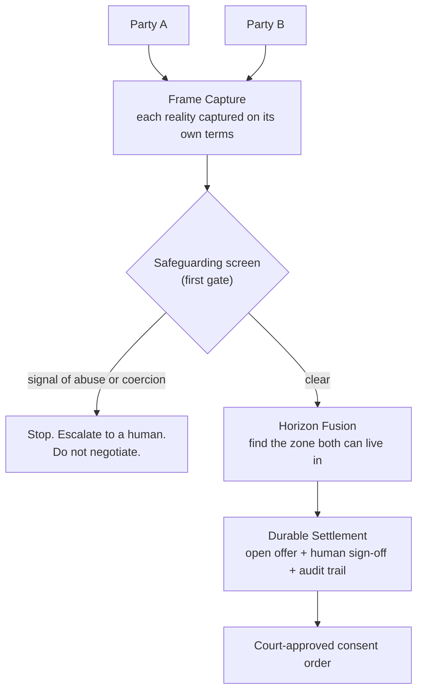

# Kramer v AI

*A supervised-autonomy layer for amicable divorce settlement.*

> There's no view from nowhere in a divorce. We don't find the truth — we build the smallest reality both people can live in.

**▶ [Watch the demo (YouTube)](https://www.youtube.com/watch?v=DcBNocXnQO0)** · [Live demo](https://kramer-v-ai-build.vercel.app)

## About

Divorce settlement gets treated as a maths problem: split the assets, divide the pot. It isn't. The numbers are the easy part. The hard part is that two people, depleted and resentful, are looking at the same marriage from two incompatible realities — and the adversarial legal process drives them further apart while billing by the hour. The settlement reached after eighteen months of disclosure warfare is worse, not just dearer, than the one that was reachable in week two.

Kramer v AI is an experiment in doing the opposite. It captures each person's account on its own terms, surfaces what neither side will say out loud, finds the zone where both realities overlap, and drafts a settlement built to last. A qualified human signs off at each consequential step, and every step leaves an audit trail.

The name is deliberately wrong. *Kramer v Kramer* is the bitter custody battle; this is its cooperative opposite. It's a working title; the real product would be renamed.

## The architecture

The **human sign-off is a setting, not a fixed choice.** The same engine can run with a solicitor on each side, one solicitor, a neutral mediator, no lawyer at all, or as pure advice. Three things stay constant whichever way the dial is turned: safeguarding runs first, the audit trail always exists, and the emotional read is only ever seen by the human in the loop, never the client.

## What's live (hackathon build)

**One party. Frame Capture, end-to-end.** Empathetic intake, safeguarding gate, audit trail. The emotional read — what the client will not say out loud — is the hero, because it is the hardest engineering problem here and the part nobody else is building. Horizon Fusion and Durable Settlement stay in the architecture as the next horizons, not this weekend's deliverable.

The pattern generalises. Divorce settlement is the demonstration because it is the most emotionally compressed legal moment most people will face. The same shape — emotional capture, safeguarding-first, supervised autonomy, audit trail — applies anywhere the law needs to hear someone before it can help them.

## Brand & soul

**Solemn Warmth.** The calm of a serious, kind room — somewhere grief can be set down and held with dignity, not hurried along or cheered up. Unhurried. Restrained, because restraint reads as care here. The opposite of a bright launch and the opposite of a cold dashboard. If a choice draws attention to itself, it's wrong; the work is to help two people put something heavy down, not to impress them.

The metaphor everything is designed against is **the overlap — the seam**: two fields meeting into a single patch of shared ground. Convergence, not opposition. The name reads as *versus*; everything the brand does says *together*.

A few language anchors that hold across the build:

> *"We don't find the truth — we build the smallest reality both people can live in."*
>
> *"We are not trying to win the divorce. We are trying to end the war."*
>
> *"Plain over clever. Clarity is a form of respect."*

For the full brand spine — emotional north star, voice, principles, on-brand vs off-brand examples, language do's and don'ts, visual territory — see the brand docs below. Visual mechanics (type, colour, layout, motion) are deliberately left to designers, decided by eye against the feeling and metaphor.

## Read next

- [`PHILOSOPHY.md`](PHILOSOPHY.md) — why "two realities" is the whole thesis, and the seven rules the build follows.
- [`MODULES.md`](MODULES.md) — the three parts: Frame Capture (live), Horizon Fusion, Durable Settlement.
- [`LEGAL.md`](LEGAL.md) — what makes this lawful and insurable in England & Wales.
- [`ENGINEERING.md`](ENGINEERING.md) — the build plan: architecture, data/compliance spine, agent pipeline, hosting, and the phased steps.
- [`docs/brand/emotive-narrative.md`](docs/brand/emotive-narrative.md) — the soul. Plutchik / Sage + Caregiver archetype, Human Moment → Deeper Truth → Transformation → Ethos → Personality → North Star.
- [`docs/brand/philosophy.md`](docs/brand/philosophy.md) — strategic essence and voice. Principles, on-brand vs off-brand examples, language to use and avoid.
- [`docs/brand/visual-philosophy.md`](docs/brand/visual-philosophy.md) — the feeling and the metaphor to design against. Visual mechanics deliberately left to designers, by eye.
- [`docs/questions-for-legal.md`](docs/questions-for-legal.md) — the open questions a family solicitor can help answer.

## Status

Exploratory. Built for the [Lawhive](https://lawhive.co.uk) Hackathon (30 May 2026), under the broad access-to-justice brief; divorce is the showcase, not the scope. It's public because I'm looking for people to think and build with — a family-law solicitor especially. If that's you, open an issue or get in touch.

## Licence

Apache 2.0. See [LICENSE](./LICENSE).
