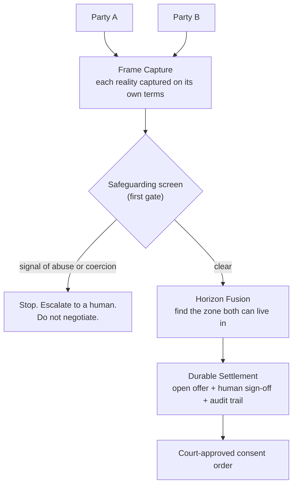

# Kramer v AI

*A supervised-autonomy workbench for amicable UK divorce settlement.*

> There is no view from nowhere in a divorce. We do not find the truth. We build the smallest reality both people can live in, and we make it hold.

**▶ [Watch the demo (YouTube)](https://www.youtube.com/watch?v=DcBNocXnQO0)** · [Live demo](https://kramer-v-ai-build.vercel.app)

## About

Divorce settlement gets treated as a maths problem: split the assets, divide the pot. It is not. The numbers are the easy part. The hard part is that two people, depleted and resentful, are looking at the same marriage from two incompatible realities. The adversarial legal process drives them further apart while billing by the hour. The settlement reached after eighteen months of disclosure warfare is worse, not just dearer, than the one that was reachable in week two.

Kramer v AI is an experiment in doing the opposite. It captures each person's account on its own terms, surfaces what neither side will say out loud, finds the zone where both realities overlap, and drafts a settlement built to last. A qualified human signs off at each consequential step. Every step leaves a hash-chained audit row.

The name is deliberately wrong. *Kramer v Kramer* is the bitter custody battle. This is its cooperative opposite. It is a working title; the real product would be renamed.

## The architecture

The **human sign-off is a setting, not a fixed choice.** The same engine can run with a solicitor on each side, one solicitor, a neutral mediator, no lawyer at all, or as pure advice. Three things stay constant whichever way the dial is turned: safeguarding runs first, the audit trail always exists, and the emotional read is only ever seen by the human in the loop, never the client.

## What is live

A six-step workbench, end-to-end, against a synthetic matter (Khan v Acme):

1. **Disclosure.** A Form E-style case pack: property, pensions, savings, vehicles, liabilities, income, children, housing needs.
2. **Emotional Read.** Reviewer-only. The watchable LLM beat. Drivers, blindspots, reviewer notes, every quote checked against the transcript.
3. **Frame Capture.** Structured synthesis of what each person actually said. Stated positions, underlying needs, fears, non-negotiables, settlement weights.
4. **Settlement.** Three defensible option shapes, each scored 1 to 10 for durability. The reviewer picks. The system does not recommend.
5. **Agreement.** Sign-off plus an agreement record. Both sides confirm.
6. **Export pack.** A solicitor-reviewable bundle: D81-style preparation summary, agreement record, audit chain, verification. The emotional read and the synthetic Party B raw frame are deliberately omitted.

Stack: React 19 + Vite + Tailwind v4 on the front. FastAPI + Anthropic SDK (Sonnet 4.6) + SQLite on the back. Cloudflare Vercel + Render Frankfurt for hosting.

The pattern generalises. Divorce settlement is the demonstration because it is the most emotionally compressed legal moment most people will face. The same shape (emotional capture, safeguarding-first, supervised autonomy, hash-chained audit) applies anywhere the law needs to hear someone before it can help them.

## Brand and soul

The live build uses a **Paper Ink** design language: white paper, ink type, a single sealing-wax red used only on destructive or refused surfaces. One typeface. Zero radius, zero shadow, zero gradient. Borders carry all depth. It reads as a serious workspace, not a launch.

The metaphor the build is designed against is **the overlap**, the seam: two fields meeting into a single patch of shared ground. Convergence, not opposition. The name reads as *versus*; everything the product does says *together*.

A few language anchors that hold across the build:

> *"We do not find the truth. We build the smallest reality both people can live in."*
>
> *"We are not trying to win the divorce. We are trying to end the war."*
>
> *"Plain over clever. Clarity is a form of respect."*

For the brand spine (emotional north star, voice, principles, on-brand vs off-brand examples, language do's and don'ts), see the brand docs below.

## Read next

- [`PHILOSOPHY.md`](PHILOSOPHY.md). Why "two realities" is the whole thesis, and the seven rules the build follows.
- [`MODULES.md`](MODULES.md). The three parts: Frame Capture, Horizon Fusion, Durable Settlement.
- [`LEGAL.md`](LEGAL.md). What makes this lawful and insurable in England and Wales.
- [`ENGINEERING.md`](ENGINEERING.md). The build plan: architecture, data and compliance spine, agent pipeline, hosting, phased steps.
- [`docs/brand/emotive-narrative.md`](docs/brand/emotive-narrative.md). The soul. Plutchik plus Sage + Caregiver archetype, Human Moment to Deeper Truth to Transformation to Ethos to Personality to North Star.
- [`docs/brand/philosophy.md`](docs/brand/philosophy.md). Strategic essence and voice.
- [`docs/brand/visual-philosophy.md`](docs/brand/visual-philosophy.md). The feeling and the metaphor to design against.
- [`docs/questions-for-legal.md`](docs/questions-for-legal.md). The open questions a family solicitor can help answer.

## Status

Built for the [Lawhive](https://lawhive.co.uk) Hackathon (30 May 2026) under the broad access-to-justice brief. Divorce is the showcase, not the scope. Did not place at the pitch on 31 May. The build is live, the smoke is green end-to-end, and iteration is continuing in public.

It is public because I am looking for people to think and build with. A family-law solicitor especially. If that is you, open an issue or get in touch.

## Licence

Apache 2.0. See [LICENSE](./LICENSE).
