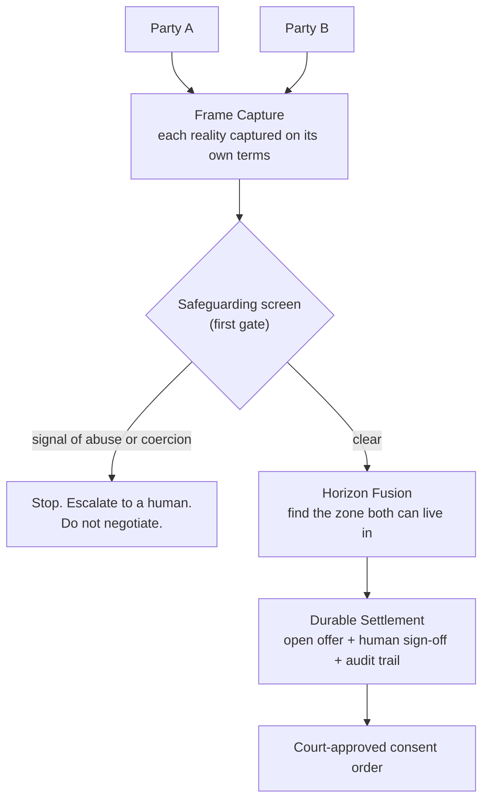

# Kramer v AI

*A supervised-autonomy layer for amicable divorce settlement.*

> There's no view from nowhere in a divorce. We don't find the truth — we build the smallest reality both people can live in.

## About

Divorce settlement gets treated as a maths problem: split the assets, divide the pot. It isn't. The numbers are the easy part. The hard part is that two people, depleted and resentful, are looking at the same marriage from two incompatible realities — and the adversarial legal process drives them further apart while billing by the hour. The settlement reached after eighteen months of disclosure warfare is worse, not just dearer, than the one that was reachable in week two.

Kramer v AI is an experiment in doing the opposite. It captures each person's account on its own terms, surfaces what neither side will say out loud, finds the zone where both realities overlap, and drafts a settlement built to last. A qualified human signs off at each consequential step, and every step leaves an audit trail.

The name is deliberately wrong. *Kramer v Kramer* is the bitter custody battle; this is its cooperative opposite. It's a working title; the real product would be renamed.

## The base concept

The **human sign-off is a setting, not a fixed choice.** The same engine can run with a solicitor on each side, one solicitor, a neutral mediator, no lawyer at all, or as pure advice. Three things stay constant whichever way the dial is turned: safeguarding runs first, the audit trail always exists, and the emotional read is only ever seen by the human in the loop, never the client.

## Read next

- [`PHILOSOPHY.md`](PHILOSOPHY.md) — why "two realities" is the whole thesis, and the seven rules the build follows.
- [`MODULES.md`](MODULES.md) — the three parts: Frame Capture, Horizon Fusion, Durable Settlement.
- [`LEGAL.md`](LEGAL.md) — what makes this lawful and insurable in England & Wales.
- [`docs/questions-for-legal.md`](docs/questions-for-legal.md) — the open questions a family solicitor can help answer.

## Status

Exploratory. Built around the [Lawhive](https://lawhive.co.uk) Hackathon (30 May 2026). It's public because I'm looking for people to think and build with — a family-law solicitor especially. If that's you, open an issue or get in touch.
