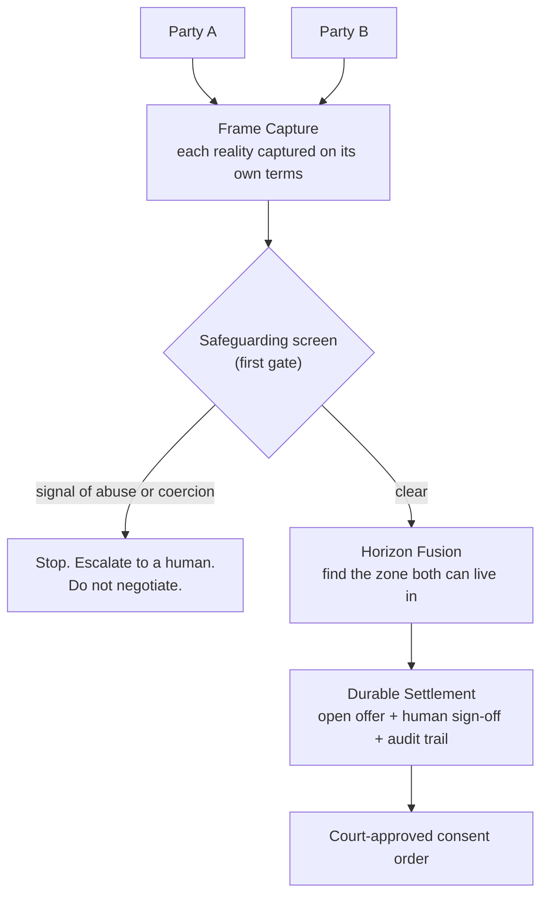

# divorce.broker

*Settlement intelligence for separating couples. End the war, not your savings.*

🌐 **Live:** [**divorce.broker**](https://divorce.broker)

*Originally built as "Kramer vs Kramer vs AI" — hence the repo name.*

> A divorce is not a problem with one truth. It is two realities, each true to the person holding it. The job is not to pick a winner. The job is to find the smallest reality both people can live with.

## What this is

Divorce settlement should not take 18 months, ruin two lives, and cost £150k.

divorce.broker is a six-stage workbench that takes two people, two intakes, three settlement options, and a solicitor at the gates, and produces a court-ready pack a solicitor can actually sign.

The interesting part is not the maths. It is the emotional input. Structured prompts inspired by relationship-pattern work from couples therapy. *Money explains what can be divided. The human part explains what a person can actually live with.*

It is not therapy. It is not diagnosis. It is structured input for settlement design.

## The demo

The live demo runs a synthetic parody pack. **Nicole Kidman v Keith Urban.** Notting Hill family home, two children mid-secondary, five active pet custody disputes, a 1959 Les Paul ("the divorce Telecaster" lives elsewhere), and a red carpet jewellery loan register that is not exhibited. **Johnny Cochran signs off.**

Walk it:

1. **Splash** — Nicole on the wall, the song drops in at 25 seconds.
2. **Money Picture** — Form E-style disclosure. Click "View demo pack" to inspect the marriage certificate, the awards display schedule, the guitar collection, and the disclosure gaps.
3. **The Human Part** — ten prompts seeded with Nicole's voice. Tone chips. Editable.
4. **Settlement Options** — three shapes, durability-scored. The reviewer picks. The system does not recommend.
5. **Talk It Through** — ask anything in plain English. *"No, he can't have visitation rights for my Oscar. Does that change things?"* Watch what the model refuses to say.
6. **Agreement** — Johnny Cochran records the agreement-in-principle.
7. **Export Pack** — a solicitor-review bundle. No court submission from here.

Five seconds from picker to a working Money Picture. No live LLM waits inside the demo — everything is pre-seeded server-side.

## The architecture

The human sign-off is a setting, not a fixed choice. The same engine can run with a solicitor on each side, one solicitor, a neutral mediator, no lawyer at all, or as pure advice. Three things stay constant whichever way the dial is turned: safeguarding runs first, the audit trail always exists, and the emotional read is only ever seen by the human in the loop, never the client.

## Stack

- **Frontend.** React 19 + Vite + Tailwind v4. Paper Ink design language. One typeface (Hanken Grotesk). Zero radius. Zero shadow. Borders carry all depth. A sealing-wax red for refused / blocked / parody. A small accent palette pulled from the splash (pink, garden green, warm gold) used sparingly on chips and selected states.
- **Backend.** FastAPI + the Anthropic SDK (Sonnet 4.6) + SQLite. App-level WORM. Hash-chained audit per matter.
- **Hosting.** Vercel for the frontend at [divorce.broker](https://divorce.broker). Render Frankfurt for the backend.
- **One streaming endpoint.** Talk It Through opens an SSE stream from the model with the option, case pack, frame capture, and reviewer-only emotional read as context. The rest of the demo is server-seeded canned data so the journey never waits.

## What is built into the demo on purpose

- **The Human Part is the conceptual heart.** Ten prompts inspired by relationship-pattern work, not therapy. Each prompt has an editable answer and a tone chip. The synthesised Frame Capture and the reviewer-only Emotional Read sit collapsed below.
- **The Settlement Room refuses to call a settlement fair.** It explains what each option is trying to balance. It names the tradeoff. It always mentions solicitor review for legal mechanics. It never recommends.
- **The audit chain is visible behind a "View proof" drawer.** Verified, hash-linked, with the technical chain available but collapsed by default. The main flow is about the settlement; the machinery is supporting evidence.
- **Safeguarding is the first gate.** A coercion signal stops everything. No optimisation overrides it.

## What is not in the demo on purpose

- No login, no upload, no role switching.
- No live LLM calls during bootstrap. The Settlement Room is the only live model call on the main path.
- No direct submission to MyHMCTS or anywhere else. The export is for solicitor review before any filing.
- No claim of court approval. No claim of clinical assessment. No claim of legal advice.

## Read next

- [`PHILOSOPHY.md`](PHILOSOPHY.md) — why "two realities" is the whole thesis.
- [`MODULES.md`](MODULES.md) — the three parts: Frame Capture, Horizon Fusion, Durable Settlement.
- [`LEGAL.md`](LEGAL.md) — what makes this lawful and insurable in England and Wales.
- [`ENGINEERING.md`](ENGINEERING.md) — architecture, data and compliance spine, agent pipeline, hosting.
- [`docs/brand/emotive-narrative.md`](docs/brand/emotive-narrative.md) — the soul.
- [`docs/brand/philosophy.md`](docs/brand/philosophy.md) — voice and principles.
- [`docs/questions-for-legal.md`](docs/questions-for-legal.md) — the open questions for a family solicitor.

## Built by

- **Andy Bird.** [GitHub](https://github.com/b1rdmania) · [LinkedIn](https://www.linkedin.com/in/andrew-bird-nomos) · [X](https://x.com/b1rdmania)
- **Christine Ng.** [LinkedIn](https://www.linkedin.com/in/christinengproductmanager/)

Music made in [wario.style](https://wario.style).

## Status

**v0.2 · public beta.** Built in a rush for the [Lawhive](https://lawhive.co.uk) hackathon (30 May 2026). Did not place. Kept building, renamed to divorce.broker, polished the guided demo. The live demo is the working surface; this repo is the public-facing thinking behind it.

It is public because I am looking for people to think and build with. A family-law solicitor especially. Open an issue or get in touch.

## Licence

Apache 2.0. See [LICENSE](./LICENSE).
